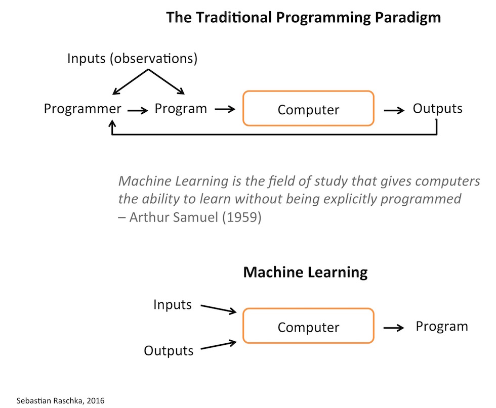

# What are data science and machine learning?

### Let's start with machine learning

In short, machine learning algorithms are algorithms that learn (often predictive) models from data. I.e., instead of formulating "rules" manually, a machine learning algorithm will learn the model for you.

So, let me give you an example to illustrate what that means! Say you are interested in implementing a spam filter. The probably most conservative approach would be to let a person sort these emails manually. Now, the "traditional" programming approach would be to look at some example emails (and/or use your "domain knowledge") to come up with a chain of rules like

*"if this email contains word X, label it as spam, else if email contains ..."*

Now,  machine learning algorithms help you formulating these rules. Or in other words, (supervised) machine learning algorithms will look at a dataset of labeled emails (spam and non-spam) and derive rules from there to separate the two classes.

### So, what is data science then?

First of all, "data science" is a pretty ambiguous, ill-defined term and interdisciplinary field; and people mean (expect) different things in different contexts. In my opinion, in practice, data science is pretty much the same as what we've known as *Data Mining* or *KDD* (Knowledge Discovery in Databases). The typical skills of a data scientists are

- Computer science: programming, hardware understanding, etc.
- Math: Linear algebra, calculus, statistics
- Communication: visualization and presentation
- Domain knowledge

Where machine learning -- at its core -- is about the use and development of these learning algorithms, data science is more about the extraction of knowledge from data to answer particular question or solve particular problems.

Machine learning is often a big part of a "data science" project, e.g., it is often heavily used for exploratory analysis and discovery (clustering algorithms) and building predictive models (supervised learning algorithms). However, in data science, you often also worry about the collection, wrangling, and cleaning of your data (i.e., data engineering), and eventually, you want to draw conclusions from your data that help you solve a particular problem.

There are numerous examples of data science applications. Assume you are working for a credit company. Your boss gives you the task to find out whether a customer is creditworthy or not. You collect transaction data, maybe shipping records and customer ratings and so forth. Next, you'll probably use a machine learning algorithm to learn a predictive model. For example, let's assume you chose to grow a decision tree, and you concluded that this particular customer is not creditworthy. Finally, you prepare a nice presentation visualizing the decision tree to answer your boss' next question: Why is this customer not creditworthy? ...